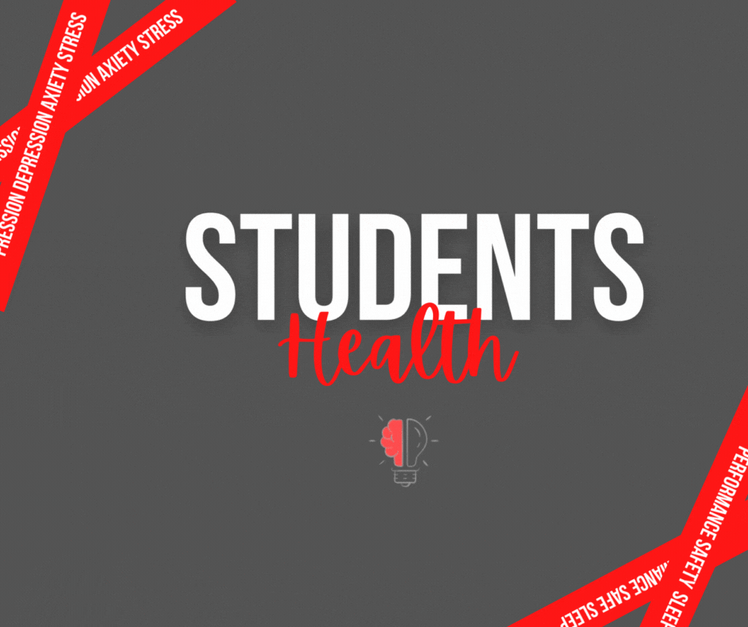

# Student Health

> **Dois de cada três estudantes do 5º e 9º ano do ensino fundamental e 3ª série do ensino médio** da rede estadual **relatam sintomas de depressão e ansiedade**. Foi o que apontou um _mapeamento desenvolvido pela_ Secretaria da Educação do Estado de São Paulo e o Instituto Ayrton Senna, que contou com a participação de 642 mil alunos no âmbito do SARESP (Sistema de Avaliação de Rendimento Escolar do Estado de São Paulo).
> 
> [Em mapeamento, 70% dos estudantes avaliados relatam sintomas de depressão e ansiedade  - Secretaria da Educação do Estado de São Paulo (educacao.sp.gov.br)](https://www.educacao.sp.gov.br/em-mapeamento-70-dos-estudantes-avaliados-relatam-sintomas-de-depressao-e-ansiedade/)

Com base na problemática acima, podemos enxergar que há uma necessidade intrínseca de tratativas para este cenário, não poderia ser ignorado em qual for o contexto, tendo isto, muitas das vezes poderíamos até ter uma tratativa encarando de forma homogênea ou generalista nosso ambiente estudantil, contudo não teria a mesma eficácia possivelmente se tratarmos de forma específica ao encontrar padrões nas características destes alunos, indo ao cerne dos possíveis conflitos.

Neste sentido a proposta é de realizar uma coleta sobre pontos vitais que afetam de forma qualitativa a vida do estudante, de forma respeitosa e voluntaria, e assim realizar uma análise exploratória acompanhado de modelos de ML (Machine Learning), e ter uma base para elaboração de tratativas e planejamento para vir se obter de uma melhora em casos mais críticos e ações que apoiem a permaneça do estado em casos saudáveis, assim obter resultados qualitativos na saúde mental do ser.

Realizamos uma extração, análise sobre dados extraídos do Kaggle, para exemplificar de como isto pode ser aplicado, e explanação dos resultados.

 ---------

## Passos:

### Coleta

- **Quantidade de alunos:** 1100

- **Fatores colhidos:**
  
  - Nível de ansiedade
  
  - Nível de autoestima
  
  - Nível de estresse
  
  - Depressão
  
  - Qualidade de sono
  
  - Anomalia respiratória
  
  - Nível Sonoro
  
  - Segurança
  
  - Necessidade básicas
  
  - Nível performance acadêmica
  
  - Carga horária de estudo
  
  - Nível de relação entre o aluno e professor
  
  - Apoio social
  
  - Pressão de grupo
  
  - Carga de atividades extra-curriculares
  
  - Bullying
  
  - Condições de vida
  
  - Dores de cabeça
    
    

### Resultados

Utilizando algoritmo de clusterização (KMeans) tendo os dados acima como matéria-prima, conseguimos identificar 3 grupos presentes, com base nas análises pós-treinamento e classificação dos mesmos, é possível analisar as características destes grupos.

#### Grupos:

- **Grupo 0:**
  
  - Este grupo contém estudantes com os menores níveis em performance e saúde mental.

- **Grupo 1:** 
  
  - Este grupo contém estudantes com os maiores níveis em performance e saúde mental.

- **Grupo 2:**
  
  - Este grupo contém estudantes seriam semelhantes com o grupo 0 em performance contudo ainda os intermediarios em saúde mental.
    
    

É enfatico o quão temos distintos grupos, e seus estados, podendo ser visto nas visualizações abaixo:

--------

.png)

#### Conclusão

Estas visualizações acima nos mostram somente a ponta do iceberg, um cenário positivo em contraste temos negativo, sendo estes frutos de fatores mais preponderantes um grupo que noutro e isto pode ser observado de forma mais explicita quando analisamos de forma micro cada um, ao ser ter essa visão será possível estudar cada um e elaborar ações para cada de forma personalizada, aumentando a eficácia e eficiência das tratativas, assim com a utilização do modelo para classificação dos alunos baseado em dados podemos fornecer uma melhor experiência ao um aluno assim consequentemente poderemos observar melhora em números ao nível de desempenho, de mais forma saudável e empática, o ambiente como todo será progressivamente mais saudável.
